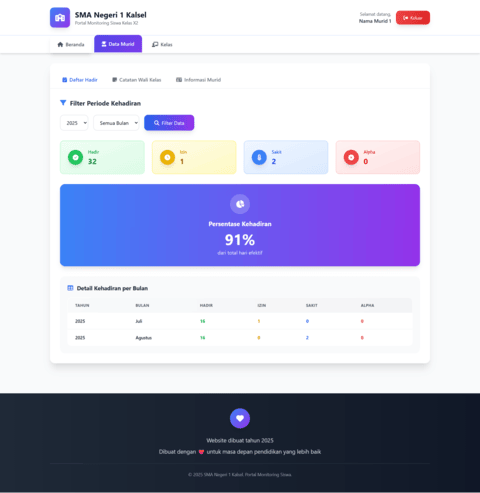
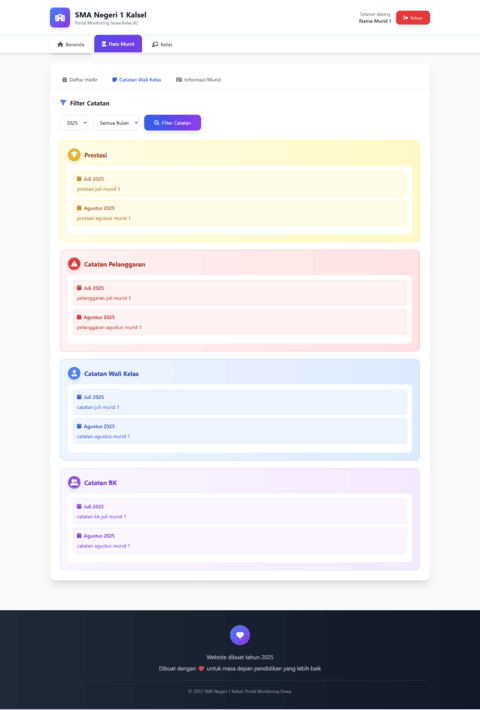
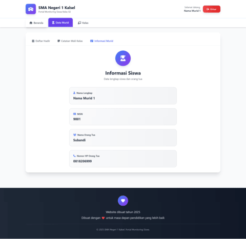

# e-Kelas

e-Kelas ditujukan kepada Bapak/Ibu guru yang bertugas sebagai wali kelas. Dengan menggunakan e-Kelas bapak/ibu bisa menampilkan data dari Google Spreadsheet ke sebuah tampilan website. Project ini adalah hasil coding dengan bantuan AI. Jika ada masukan atau saran bisa menghubungi pengembang.

## Features

**Login**
- kolom `nisn` sebagai username
- kolom `paswd` sebagai password

**Data Murid**
- Daftar Hadir (Izin, Sakit Alpha)
- Catatan (Wali Kelas dan BK)
- Informasi (Nama, NISN, Orang Tua, dan Kontak Orang Tua)

**Kelas**
- Informasi Kelas
- Informasi Kontak Wali Kelas

## Deployment

**1. Template Spreadsheet**

- Buka link Template Spreadsheet berikut: https://s.id/template-spreadsheet-ekelas.
- Duplikat Template Spreadsheet tersebut.
- Simpan pada folder Google Drive kamu.

**2. Kode AppScript**

- Silahkan copy [Code.gs](https://github.com/nrwahyuaji).
- Buka Template Spreadsheet.
- Di menu bagian atas, silahkan klik `extension` kemudian klik `AppScript` .
- Beri nama aplikasi kamu di bagian title atas.
- Pada bagian `Code.gs` silahkan pastekan kode yang tadi sudah di copy.
- Klik `Deploy`.
- Klik `New deployment`.
- Isikan description sesuai kemauan kamu.
- Pada bagian `execute as` pilih `Me (namaemailkamu@gmail.com)`.
- Pada bagian `who has access` pilih `Anyone`.
- Klik `Deploy`.
- Salin URL AppScript Spreadsheet yang berawalan `https://script.google.com/macros/s/blablabla`

**3. Edit index.html**

- Buka index.html
- Cari kode `const GOOGLE_APPS_SCRIPT_URL = "ISIKAN_URL_KAMU";`
- Pada bagian `ISIKAN_URL_KAMU` ganti dengan URL AppScript Spreadsheet yang tadi kamu copy.
- Selesai.

## Screenshoots ##

**Daftar Hadir**  

**Catatan Wali Kelas**  

**Informasi Murid**  

## Authors

- [@nrwahyuaji](https://www.github.com/nrwahyuaji)

